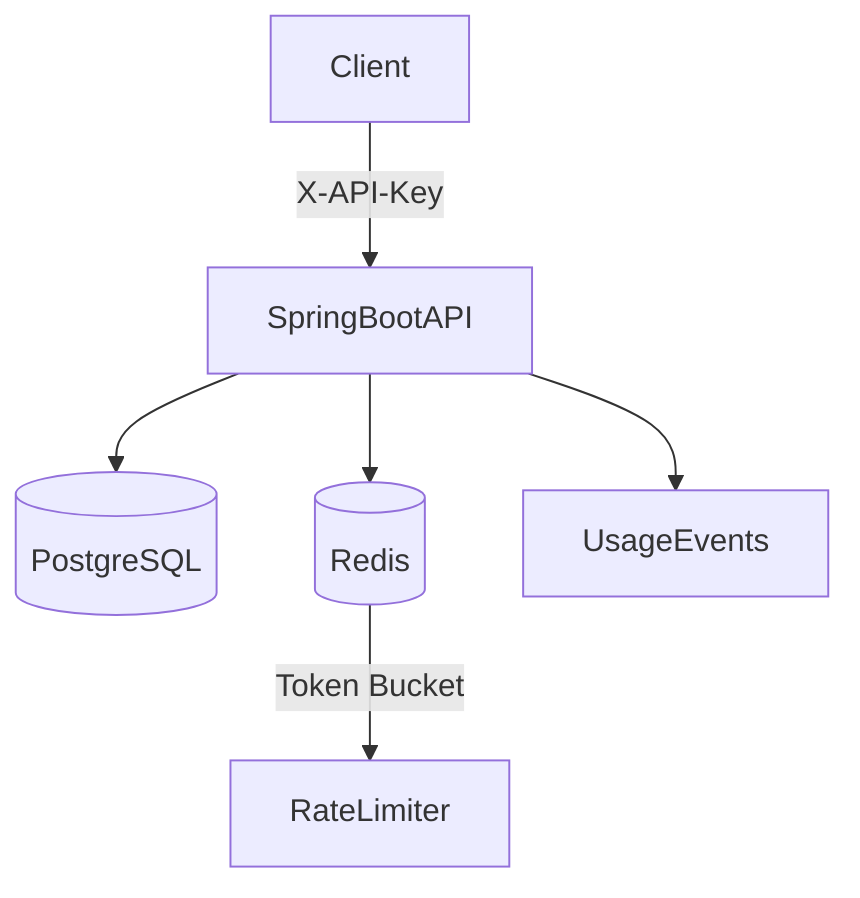

# Rate-Limited API Key Platform (Java + Spring Boot)

## Overview

Production-style API key management system built with Spring Boot.

Features:
- API key issuance & rotation
- Secure SHA-256 hashing (no raw key storage)
- Redis-based distributed rate limiting (token bucket)
- PostgreSQL persistence
- Dockerized local orchestration
- Swagger API documentation

---

## Architecture



---

## Tech Stack

- Java 21
- Spring Boot 3
- PostgreSQL
- Redis
- Docker Compose
- OpenAPI (Swagger)

---

## System Design Decisions

- API keys are hashed using SHA-256 before persistence
- Redis token bucket algorithm used for rate limiting
- Rate limiting enforced per API key
- Separate entities for Customer, APIKey, and UsageEvent
- Stateless API design

---

## Running Locally

```bash
docker compose up --build
```

Swagger UI:
http://localhost:8082/swagger-ui/index.html

---

## Key Endpoints

- `POST /auth/register` → create customer
- `POST /keys` → issue key
- `POST /keys/rotate` → rotate key
- `GET /protected/ping` → test rate-limited endpoint (requires `X-API-Key`)

---

## Security Considerations

- Raw API keys are never stored
- Hash comparison prevents key leakage
- Rate limiting mitigates brute-force attacks
- Redis TTL clears stale token buckets

---

## Future Improvements

- Per-key configurable quotas
- Prometheus metrics integration
- Distributed Redis cluster support
- Integration test suite
- Key usage analytics dashboard

---

## Why This Project Matters

Demonstrates:
- Backend API design
- Secure key management
- Distributed rate limiting
- Dockerized multi-service orchestration
- Production-oriented thinking

---

Generated: 2026-03-02
